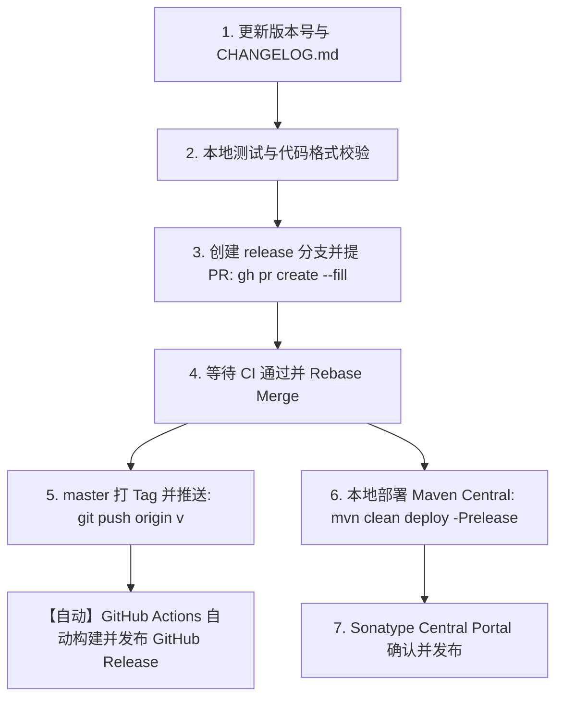

# Release Guide (发布操作手册)

本文档面向 QingStor Java SDK 维护者，详细记录了标准版本发布操作流程 (Release SOP)。

---

## 流程概览



---

## 详细步骤

### 第一步：版本号更新与本地校验

1. **更新版本号清单 (Version Bump)**：
   - `pom.xml`: `<version>X.Y.Z</version>`
   - `src/main/resources/version.properties`: `version=X.Y.Z`
   - `docs/install.md`: Maven 依赖版本
   - `docs/install_zh-CN.md`: Maven 依赖版本
   - `CHANGELOG.md`: 补充 `## [vX.Y.Z] - YYYY-MM-DD` 对应更新日志
2. **本地执行验证**：
   ```bash
   mvn spotless:apply
   mvn test
   mvn verify -DskipITs -Dgpg.skip
   ```

---

### 第二步：创建发布分支并提交 PR

```bash
# 1. 切出发布分支并提交
git checkout -b release/v<version>
git push -u origin release/v<version>

# 2. 使用 gh 创建 Pull Request
gh pr create --fill
```

---

### 第三步：等待 CI 校验并合并

```bash
# 1. 检查 CI 运行状态
gh pr checks

# 2. 执行 Rebase Merge（管理员使用 --admin 绕过审批限制立即合并）
gh pr merge --rebase --delete-branch --admin
```

> **说明**：仓库配置了 1 位 Reviewer 审批规则，维护者使用 `--admin` 参数可直接以管理员权限绕过限制完成合并（等同于网页端勾选 Bypass rules）。

---

### 第四步：打 Tag 触发 GitHub Release 自动化发布

```bash
# 1. 切换回 master 并拉取最新合并代码
git checkout master
git pull origin master

# 2. 打 Tag 并推送到 GitHub 远程仓库
git tag -a v<version> -m "Release v<version>"
git push origin v<version>

# 3. 监控 GitHub Actions 自动化发布进度
gh run watch
```

> **自动化说明**：
> GitHub Actions (`.github/workflows/release.yml`) 会在检测到 `v*` Tag 后自动触发：
> - 使用 JDK 8 环境执行验证
> - 自动打包生成标准 Jar 与 Shaded Jar
> - 自动从 `CHANGELOG.md` 提取当前版本的 Release Notes
> - 自动创建 GitHub Release 并附加两个 Jar 产物

---

### 第五步：发布至 Maven Central

在具备 GPG 私钥与 Sonatype 认证配置的环境下执行：

```bash
# 本地执行构建、签名与上传（切勿激活 shade-all Profile）
mvn clean deploy -Prelease
```

1. 上传成功后，登录 [Sonatype Central Portal](https://central.sonatype.com/)。
2. 在 **Deployments** 列表中确认当前部署包校验状态为 **Validated**。
3. 点击 **Publish** 按钮确认发布（约 15~30 分钟内全球镜像同步生效）。
